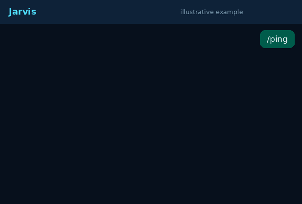

<div align="center">


<a href="https://github.com/nicholas-pp8/jarvis-whatsapp-bot">
  
</a>

<p>
  
  
  
  
</p>

<p><b>A modular WhatsApp bot with downloaders, AI chat, image tools and group management.</b><br/>Pairing-code login, no QR. Runs on small free hosts (about 150 MB RAM).</p>



</div>

---

> [!WARNING]
> Baileys is an unofficial WhatsApp client. WhatsApp can restrict or ban numbers that use it, and group tools (mass tagging, adding or removing people, auto moderation) raise that risk. Use a number you can afford to lose. Read [Ban-risk notes](#ban-risk-notes) before turning anything on.

## Features

* **Downloaders**: YouTube audio (`/play`) and video (`/video`) by name or link, Pinterest images and videos by link or search term.
* **AI**: `/ask` talks to Gemini, Groq or OpenRouter, whichever keys you set. It tries them in order and falls back on errors.
* **Image tools**: stickers with your own pack name, sticker to image, resize, compress, convert. Works as a caption or as a reply to media.
* **Group management**: welcome and goodbye messages, rules, warnings with history, anti-link, anti-spam, anti-flood, blocked words, mute, scheduled messages, stats, invite link tools, add/remove/promote/demote.
* **Permission levels**: bot owner > bot admin > WhatsApp group admin > member.
* **Safe by default**: every automatic group feature is off until a group admin turns it on. Admins are never auto moderated.
* **Crash safe**: errors are caught per message and per group. One bad message never stops the bot. The connection reconnects by itself.
* **Modular**: drop a file into `src/commands/` and it becomes a command. Group tools live in `src/groups/` and plug in without touching the connection code.
* **Live stats** in `/menu` and `/status`: uptime, RAM, CPU, command usage.

## Commands

All 39 commands. The default prefix is `/` and can be changed in `.env`.

### General (3)

| Command | What it does | Aliases |
| --- | --- | --- |
| `/menu` | Show all commands | `/start`, `/commands` |
| `/help [command]` | Explain how to use the bot or one command | `/h` |
| `/ping` | Check that the bot is alive and how fast it replies | - |

### Downloaders (3)

| Command | What it does | Aliases |
| --- | --- | --- |
| `/play <name or link>` | Download the audio of a YouTube video (M4A) | `/ytaudio`, `/ytmp3`, `/song` |
| `/video <name or link>` | Download a YouTube video (MP4) | `/ytvideo`, `/ytmp4`, `/yt` |
| `/pinterest <name or link>` | Find a Pinterest pin by name, or download one from a link | `/pin` |

### Image tools (5)

| Command | What it does | Aliases |
| --- | --- | --- |
| `/sticker (send or reply to an image)` | Make a sticker from an image or short video | `/s`, `/stiker` |
| `/toimg (reply to a sticker)` | Turn a sticker into an image | `/toimage`, `/unsticker` |
| `/resize 800 (send or reply to an image)` | Resize an image to a width in pixels | - |
| `/compress 60 (quality 10-95, optional)` | Make an image smaller in file size | `/shrink` |
| `/convert png (png, jpg or webp)` | Convert an image to png, jpg or webp | `/toformat` |

### AI (1)

| Command | What it does | Aliases |
| --- | --- | --- |
| `/ask <question>` | Ask an AI anything | `/ai` |

### Bot (1)

| Command | What it does | Aliases |
| --- | --- | --- |
| `/status` | Show bot status: uptime, memory, usage and more | - |

### Group management (26)

| Command | What it does | Aliases |
| --- | --- | --- |
| `/add 919876543210` | Add a person by number (admins) | - |
| `/announce <text>` | Post an announcement (admins) | - |
| `/antiflood on|off` | Turn Anti-flood on or off (admins) | - |
| `/antilink on|off` | Turn Anti-link on or off (admins) | - |
| `/antispam on|off` | Turn Anti-spam on or off (admins) | - |
| `/blockword add|remove|list [word]` | Manage blocked words (admins) | `/badword` |
| `/botadmin add|remove|list @person` | Manage bot admins (owner only) | - |
| `/demote @person` | Remove admin rights (admins) | - |
| `/goodbye on|off` | Turn Goodbye message on or off (admins) | - |
| `/groupconfig [setting value]` | View or change group settings (admins) | `/gconfig`, `/gsettings` |
| `/groupinfo` | Show info about this group | `/ginfo` |
| `/grouplink` | Get the invite link (admins) | `/link` |
| `/groupstats` | Message counts and top members | `/gstats` |
| `/mute` | Only admins can send (admins) | - |
| `/promote @person` | Make someone an admin (admins) | - |
| `/remove @person` | Remove a person (admins) | `/kick` |
| `/resetwarn @person` | Clear warnings of a member (admins) | `/clearwarn` |
| `/revoke` | Reset the invite link (admins) | `/resetlink` |
| `/rules` | Show the group rules | - |
| `/schedule 09:00 text | list | del <id>` | Daily scheduled message (admins) | - |
| `/setrules <text>` | Set the group rules (admins) | - |
| `/tagall [message]` | Mention everyone once (admins, 10 min cooldown) | `/everyone` |
| `/unmute` | Everyone can send (admins) | - |
| `/warn @person [reason]` | Warn a member (admins) | - |
| `/warnings [@person]` | Show warnings of a member | `/warns` |
| `/welcome on|off` | Turn Welcome message on or off (admins) | - |

Group commands only work inside groups. "(admins)" means WhatsApp group admins or higher. The bot must be a group admin for `/add`, `/remove`, `/promote`, `/demote`, `/grouplink`, `/revoke`, `/mute`, `/unmute` and for deleting messages.

## Install

You need Node.js 20 or newer.

```bash
git clone https://github.com/nicholas-pp8/jarvis-whatsapp-bot.git
cd jarvis-whatsapp-bot
npm install
cp .env.example .env
```

Edit `.env`: set `OWNER_NUMBER` (digits only, with country code, no plus) and optionally `PAIRING_NUMBER`.

## Run

```bash
npm start
```

On first start the bot prints an 8 character **pairing code**. On your phone open WhatsApp, go to Linked devices, choose Link with phone number, and type the code. The login is saved in `auth/` so you only do this once.

## Configure

Everything is in `.env`. See `.env.example` for all options.

| Setting | Meaning |
| --- | --- |
| `BOT_NAME`, `PREFIX` | Name and command prefix |
| `OWNER_NUMBER` | Number with owner rights |
| `ALLOW_GROUPS`, `OWNER_ONLY` | Where and for whom the bot answers |
| `GEMINI_API_KEY`, `GROQ_API_KEY`, `OPENROUTER_API_KEY` | Free AI keys for `/ask`. Any one is enough |
| `BOT_TZ` | Timezone for `/schedule` |
| `MAX_FILE_SIZE_MB`, `MAX_VIDEO_HEIGHT`, `COMMAND_COOLDOWN` | Download and rate limits |

Keys are free: [Google AI Studio](https://aistudio.google.com/apikey), [Groq](https://console.groq.com/keys), [OpenRouter](https://openrouter.ai/keys).

## Group setup

1. Add the bot number to your group and make it an admin.
2. Type `/groupconfig` to see the settings.
3. Turn on only what you want: `/welcome on`, `/antilink on`, `/antispam on`, `/antiflood on`, `/blockword add <word>`.
4. Set `/setrules <text>` and a daily message with `/schedule 09:00 Good morning`.

Settings are stored per group in `data/groups.sqlite` when SQLite works on your host, or `data/groups.json` otherwise. Warnings keep their history.

## Ban-risk notes

* All automatic moderation is **off by default**. Turn on one feature at a time.
* `/tagall` mentions everyone in one message and has a 10 minute cooldown for admins.
* All bot messages and admin actions go through one queue: about one message per 1.2 seconds, and one add/remove/promote per 2.5 seconds.
* Do not add many people quickly with `/add`. Share the invite link instead.
* Do not run the bot in many large groups from a brand new number.
* Never share your `auth/` folder or `.env`. Anyone with `auth/` controls the WhatsApp account.

## Project layout

```text
src/
  commands/     one file per command (auto loaded)
  groups/       group module: storage, permissions, moderation, scheduler, commands
  downloaders/  YouTube and Pinterest
  ai/           AI providers
  connection/   Baileys connection and pairing
  handlers/     message and command handling
  utils/        image tools, queue, logging, helpers
test/           node --test suites
```

Add a command: create `src/commands/hello.js` that exports `{ name, category, description, usage, run(ctx) }`.

## Tests

```bash
npm test
```

## License

MIT
